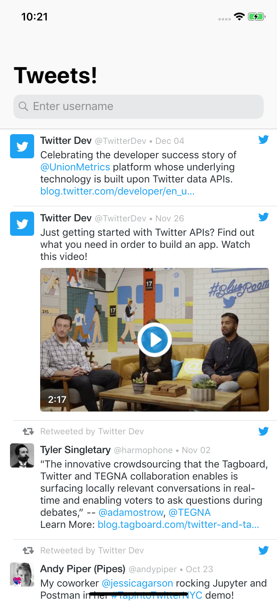
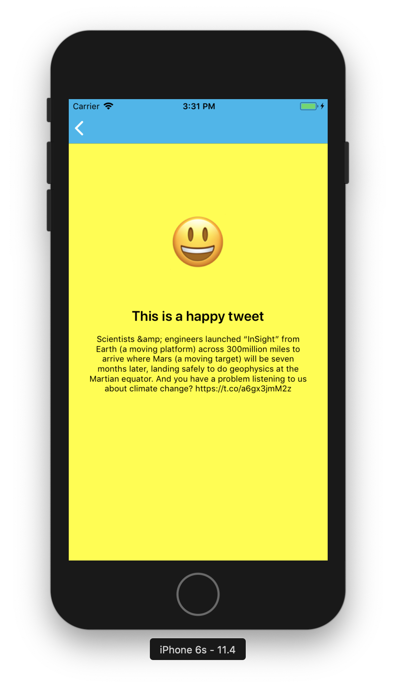
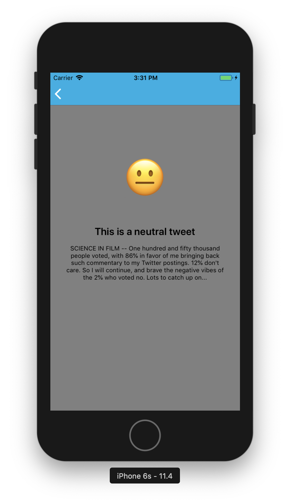
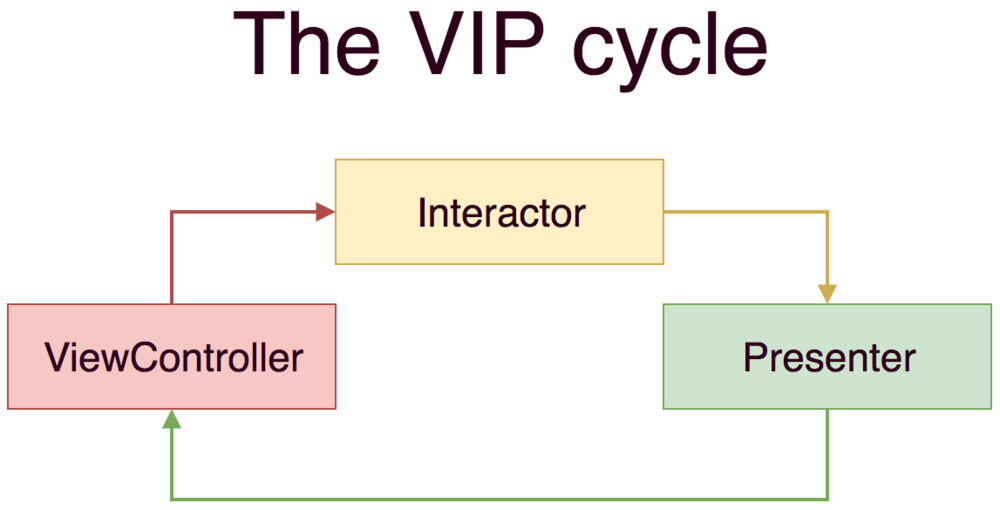
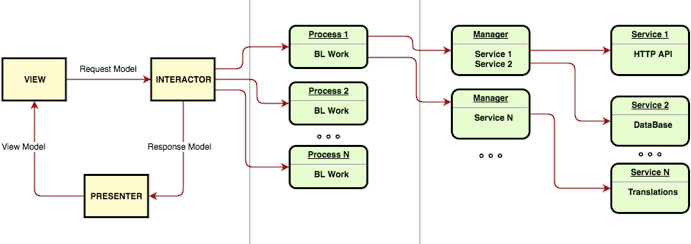

# ifood-mobile-test
This app analyzes the mood of a user's tweet. It allows searching the tweets from a specific user and choose which one will have its text analyzed in order to find its mood (happy, neutral or sad).

## Screenshots

  
  
  
  

## Building the project
1. Clone this repository to a directory
2. Run `pod install` in that directory (you may need to run `pod repo update` before)
3. Open the project on Xcode
4. Click the run button

## Cocoapods dependencies
* [**TwitterKit**](https://github.com/twitter/twitter-kit-ios) A native SDK to include Twitter content inside mobile apps
* [**Alamofire**](https://github.com/Alamofire/Alamofire) Alamofire is an HTTP networking library written in Swift
* [**Lottie**](https://github.com/airbnb/lottie-ios) An iOS library to natively render After Effects vector animations
* [**KeychainAccess**](https://github.com/kishikawakatsumi/KeychainAccess) Simple Swift wrapper for Keychain that works on iOS, watchOS, tvOS and macOS
* [**Firebase**](https://firebase.google.com) Firebase lets you build more powerful, secure and scalable apps, using world-class infrastructure

## Architecture
This project is coded using the VIP Architecture (CleanSwift).

The Clean Swift Architecture or, as also called, "VIP" was introduced to the world by https://clean-swift.com and was originated by Uncle Bob's Clean Architecture ideas. (https://blog.cleancoder.com/uncle-bob/2012/08/13/the-clean-architecture.html)

The VIP's main characteristic is the VIP cycle which explains its acronym definition.

  

The VIP cycle differs from the VIPER relationship model. In VIPER, the communication between Interactor and Presenter, and View and Presenter is bidirectional. 

Instead, VIP follows a unidirectional approach, where the ViewController talks to the Interactor, the Interactor runs business logic with its collaborators and passes the output to the Presenter, and the Presenter formats the Interactor output and gives the response (or view model) to the ViewController, so it can render its Views.

The VIP or "Clean Swift" has more components than just ViewControllers, Interactors, and Presenters, for example, Data Models, Routers and Workers.

  

# Requirements
Create an app that given an Twitter username it will list user's tweets. When I tap one of the tweets the app will visualy indicate if it's a happy, neutral or sad tweet.

## Business rules
* Happy Tweet: We want a vibrant yellow color on screen with a 😃 emoji
* Neutral Tweet: We want a grey colour on screen with a 😐 emoji
* Sad Tweet: We want a blue color on screen with a 😔 emoji
* For the first release we will only support english language

### Hints
* You may use Twitter's oficial API (https://developer.twitter.com) to fetch user's tweets 
* Google's Natural Language API (https://cloud.google.com/natural-language/) may help you with sentimental analysis.

## Non functional requirements
* As this app will be a worldwide success, it must be prepared to be fault tolerant, responsive and resilient.
* Use whatever language, tools and frameworks you feel comfortable to.
* Briefly elaborate on your solution, architecture details, choice of patterns and frameworks.
* Fork this repository and submit your code.
