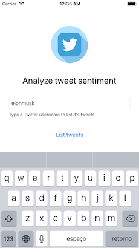

# Twimotion (ifood-mobile-test)

An iOS app that analyse a tweet sentiment.

---- 

## Screenshots 
 
 <p align="center">
  
  
  
  
  
</p>

## Requirements
1. Xcode 9.
2. Swift 4.1.
3. Cocoapods version `1.4.0`

## Getting Started
1. Clone this repository
2. Run `pod install`
3. Run project 🎉

## Architecture

This app conforms to [**MVVM** (Model-View-ViewModel)](https://en.wikipedia.org/wiki/Model%E2%80%93view%E2%80%93viewmodel) with [Coordinator](https://will.townsend.io/2016/an-ios-coordinator-pattern) Patter and was implemented using Swift 4.1.

### Dependencies
> All of dependencies and third libraries used in this project as well as its versions can be found in [Podfile](https://github.com/antonyalkmim/Twimotion/blob/master/Podfile).

- [SwiftLint](https://github.com/realm/SwiftLint) to maintain a good code quality.
- [SwiftGen](https://github.com/SwiftGen/SwiftGen) to generate a type-safe reference for resources (Localizable.strings and Assets).
- [SwiftKeychainWrapper](https://github.com/jrendel/SwiftKeychainWrapper) to save API's tokens on Keychain
- [RxSwift/RxCocoa](https://github.com/ReactiveX/RxSwift) to bind views and reactive code
- [RxDataSources](https://github.com/RxSwiftCommunity/RxDataSources) to bind viewModels on tableView
- [PINRemoteImage](https://github.com/pinterest/PINRemoteImage) to load and cache user thumb image.
- [Quick](https://github.com/Quick/Quick) for behavior tests 
- [Nimble](https://github.com/Quick/Nimble) for tests asserts

## TO-DO
- [ ] Improve UI/UX
- [ ] Add more tests and increase code coverage percentage
- [ ] Add UI tests
- [ ] Add support for more languages
- [ ] Add support for iPad
- [ ] Add A11n for accessibility

## Use Case
```
# ifood-mobile-test
Create an app that given an Twitter username it will list user's tweets. When I tap one of the tweets the app will visualy indicate if it's a happy, neutral or sad tweet.

## Business rules
* Happy Tweet: We want a vibrant yellow color on screen with a 😃 emoji
* Neutral Tweet: We want a grey colour on screen with a 😐 emoji
* Sad Tweet: We want a blue color on screen with a 😔 emoji
* For the first release we will only support english language

### Hints
* You may use Twitter's oficial API (https://developer.twitter.com) to fetch user's tweets 
* Google's Natural Language API (https://cloud.google.com/natural-language/) may help you with sentimental analysis.

## Non functional requirements
* As this app will be a worldwide success, it must be prepared to be fault tolerant, responsive and resilient.
* Use whatever language, tools and frameworks you feel comfortable to.
* Briefly elaborate on your solution, architecture details, choice of patterns and frameworks.
* Fork this repository and submit your code.
```

# License
----
```
The MIT License (MIT)

Copyright (c) 2018 Antony Alkmim

Permission is hereby granted, free of charge, to any person obtaining a copy of
this software and associated documentation files (the "Software"), to deal in
the Software without restriction, including without limitation the rights to
use, copy, modify, merge, publish, distribute, sublicense, and/or sell copies of
the Software, and to permit persons to whom the Software is furnished to do so,
subject to the following conditions:

The above copyright notice and this permission notice shall be included in all
copies or substantial portions of the Software.

THE SOFTWARE IS PROVIDED "AS IS", WITHOUT WARRANTY OF ANY KIND, EXPRESS OR
IMPLIED, INCLUDING BUT NOT LIMITED TO THE WARRANTIES OF MERCHANTABILITY, FITNESS
FOR A PARTICULAR PURPOSE AND NONINFRINGEMENT. IN NO EVENT SHALL THE AUTHORS OR
COPYRIGHT HOLDERS BE LIABLE FOR ANY CLAIM, DAMAGES OR OTHER LIABILITY, WHETHER
IN AN ACTION OF CONTRACT, TORT OR OTHERWISE, ARISING FROM, OUT OF OR IN
CONNECTION WITH THE SOFTWARE OR THE USE OR OTHER DEALINGS IN THE SOFTWARE.
```
> Special thanks for [flaticon](https://www.flaticon.com) for the free assets.
