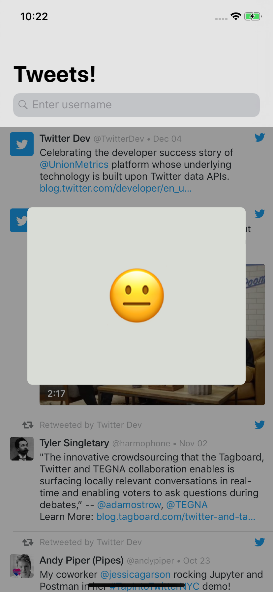
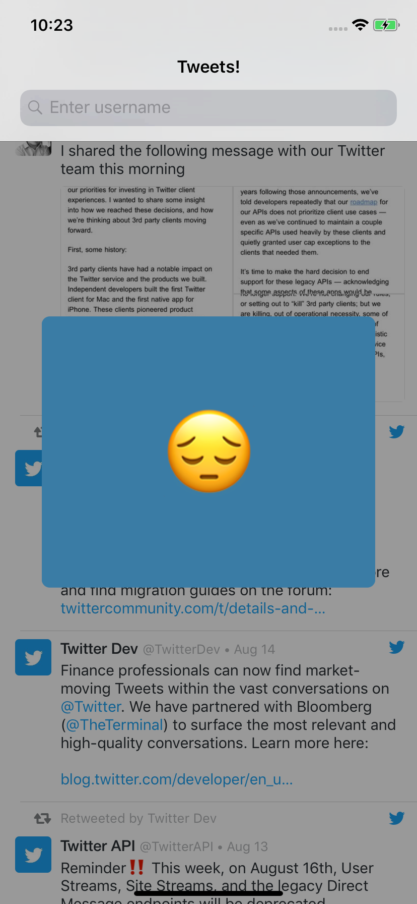

# Tweet sentiment analysis (ifood-mobile-test)


An iOS app that analyse a tweet sentiment.

---

## Screenshots

<p align="center">
  
  
  
  
</p>

## Requirements

1. Xcode 9.4.1
2. Swift 4.1
3. Cocoapods version `1.5.3`

## To run
1. Clone this repository
2. Run `pod install`
3. Run project 🚀

## Architecture

This App conforms to [**VIP** (Clean Swift Architecture)](https://hackernoon.com/introducing-clean-swift-architecture-vip-770a639ad7bf)

<p align="center">
  
</p>

### Dependencies
> All of dependencies and third libraries used in this project as well as its versions can be found in [Podfile](https://github.com/rafaelhziliao/ifood-mobile-test/blob/master/ifood-devtest/Podfile).

* [**Cocoapods-keys**](https://github.com/orta/cocoapods-keys) A key value store for enviroment and application keys
* [**TwitterKit**](https://github.com/twitter/twitter-kit-ios) A native SDK to include Twitter content inside mobile apps.
* [**Moya**](https://github.com/Moya/Moya) Network abstraction layer
* [**Lottie**](https://github.com/airbnb/lottie-ios) An iOS library to natively render After Effects vector animations

## TO-DO

* [ ] Add assert tests
* [ ] Add behavior tests
* [ ] Add UI tests
* [ ] Add stage and production enviroments

## Use Case
```
# ifood-mobile-test
Create an app that given an Twitter username it will list user's tweets. When I tap one of the tweets the app will visualy indicate if it's a happy, neutral or sad tweet.

## Business rules
* Happy Tweet: We want a vibrant yellow color on screen with a 😃 emoji
* Neutral Tweet: We want a grey colour on screen with a 😐 emoji
* Sad Tweet: We want a blue color on screen with a 😔 emoji
* For the first release we will only support english language

### Hints
* You may use Twitter's oficial API (https://developer.twitter.com) to fetch user's tweets 
* Google's Natural Language API (https://cloud.google.com/natural-language/) may help you with sentimental analysis.

## Non functional requirements
* As this app will be a worldwide success, it must be prepared to be fault tolerant, responsive and resilient.
* Use whatever language, tools and frameworks you feel comfortable to.
* Briefly elaborate on your solution, architecture details, choice of patterns and frameworks.
* Fork this repository and submit your code.
```
